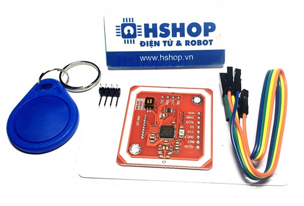
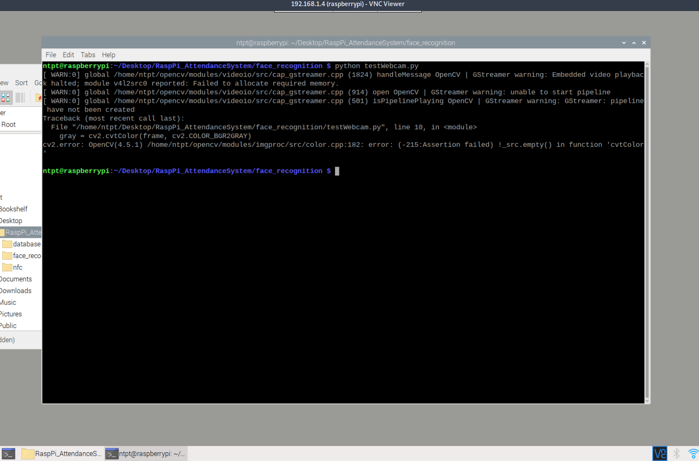

# Mục tiêu dự án

Mục tiêu của dự án này là thực hiện hệ thống điểm danh sử dụng nhận diện khuôn mặt phối hợp với thẻ RFID/NFC. Phần cứng được sử dụng sẽ là board mạch Raspberry Pi 4 và viết hoàn toàn bằng Python 3.

Hệ thống này này sẽ có khả năng:

- Đọc thẻ từ người dùng
- Sử dụng một cơ sở dữ liệu nhỏ để truy xuất các thông tin cần thiết cho việc nhận diện khuôn mặt
- Sử dụng nhận diện khuôn mặt ứng với dữ liệu được lưu. Nếu hoàn tất, xác thực thành công. Ngược lại từ chối.
- Có khả năng đăng kí khuôn mặt người dùng vào cơ sở dữ liệu

# Mã nguồn và các tài liệu của dự án

Tất cả mọi mã nguồn, bao gồm báo cáo này, slide thuyết trình, các ghi chú trong việc tìm hiểu đều được lưu lại trên GitHub: [https://github.com/ntpt7921/RaspPi_AttendanceSystem](https://github.com/ntpt7921/RaspPi_AttendanceSystem)

# Phần cứng và phần mềm sử dụng

## Phần cứng

- Raspberry Pi 4 (2GB RAM) - yếu điểm của dự án
- PN532 module ([Hshop](https://hshop.vn/products/mach-rfid-nfc-13-56mhz-pn532))
- Camera Raspberry Pi V1 OV5647 ([Hshop](https://hshop.vn/products/camera-raspberry-pi))
- MIFARE Classic 1K ([Hshop](https://hshop.vn/products/the-nhua-nfc-philips-s50rfid-13-56-mhz))

## Phần mềm

- Thư viện thị giác máy tính OpenCV ([documentation chính thức](https://docs.opencv.org/4.5.1/)), phiên bản 4.5.1
- Thư viện cho module PN532 của Waveshare ([documentation chính thức](https://www.waveshare.com/wiki/PN532_NFC_HAT)))

# Kết quả

Thất bại trong việc ứng dụng hệ thống nhận diện khuôn mặt. Trong các mục tiêu đã đề ra:

- Đọc thẻ từ người dùngt
    - Có khả năng đọc thẻ từ người dùng, đã thử thành công trên phần cứng
- Sử dụng một cơ sở dữ liệu nhỏ
    - Có ứng dụng một cơ sở dữ liệu dùng để map ID của thẻ thành tên mô hình để nhận diện khuôn mặt, đã thử thành công trên phần cứng
- Sử dụng nhận diện khuôn mặt
    - Đã thử nghiệm trên máy laptop cá nhân và chạy được. Không thể khởi động camera của Raspberry Pi để có thể thử. Không thể phân biệt được khuôn mặt thật và bức ảnh của khuôn mặt
- Có khả năng đăng kí khuôn mặt mới
    - Cũng đã thử nghiệm trên máy laptop và chạy được. Không dùng camera trên Raspberry Pi được

Thất bại trong mục tiêu chính, nội dung chính của báo cáo này là miêu tả các phần đã làm được và nhìn nhận về lí do thât bại.

# Cấu trúc chung cho toàn dự án

Phân tích công việc cần phải thực hiện ta có thể chia dự án này ra làm các phần

- [RFID/NFC](#RFID_NFC): Tìm hiểu cách đẻ đọc được thẻ + các thông tin liên quan
- [Database](#Database): Tìm hiểu cách để có thể lưu và truy xuất dữ liệu của nhiều cá nhân
- [Face Recognition](#Face_Recog): Tìm hiểu và ứng dụng việc nhận diện và phân biệt khuôn mặt người

Quy trình hoạt đông cơ bản của hệ thống được dự tính như sau: Hệ thống sẽ liên tục dò các thẻ lân cận với bộ đọc. Trong trường hơp có một thẻ (được cho ở đây)

## RFID/NFC {#RFID_NFC}

Sử dụng module PN532 và thư viện PN532 NFC HAT của Waveshare, việc đọc thẻ có thể được thực hiện khá dễ dàng.



Sử dụng chip PN532, ta có khả năng đọc và ghi thẻ Mifare 1K. Trong dự án này ta sẽ sử dụng hai chức năng được thư viện cung cấp: đợi thẻ, và đọc thẻ.

Có thể thấy rằng thư viện mà Waveshare cung cấp cho board mà họ sản xuất không thực sự giống với module mua được từ Hshop. Việc sử dụng thư viện này là vì trong bước đàu tim hiểu, không tìm thấy thư viện Python cho board mua được. Nên việc chọn thư viện phụ thuộc chủ yếu vào việc so sánh các board được chung cấp chính thức sử dụng thư viện và board mua, rồi đọc qua thư viện để xem xét liệu có thể thay thế module hay không. Sau khi coi qua thư viện của Adafruit, và Seeed Studio và Waveshare, Waveshare được chọn.

Về phần cứng, phải hàn thêm một số đường tín hiệu, sao chép cho đúng với board breakout chính thức.

Sau khi tìm hiểu thêm, một thư viện khác tương thích hơn nhiều trên [PyPi](https://pypi.org/project/pn532pi/) được tìm thấy. Nhưng đã viết quá nhiều mã phụ thuộc và thời gian không cho phép, nên không thể thay thế thư viện được.

Lợi dụng tính chất sẵn có của thẻ Mifare - block đầu tiên (số 0) của sector 0 là chỉ đọc và sẽ là nơi lưu trữ UID (unique ID) của thẻ và các thông tin của nhà sản xuất, ta có thể sử dụng nội dung block này để định danh thẻ mà không cần phải thực hiện ghi vào các block còn lại. Điều này nghĩa là ta sẽ có 16 byte dữ liệu (độ lớn block) để định danh thẻ.

Thông tin thêm về RFID/NFC được lưu trong file [`NOTE.md`](https://github.com/ntpt7921/RaspPi_AttendanceSystem/blob/main/nfc/NOTE.md), nằm trong thư mục [`nfc`](https://github.com/ntpt7921/RaspPi_AttendanceSystem/tree/main/nfc).

## Database {#Database}

Thành phần thứ hai phục vụ chức năng của dự án. Kém quan trọng hơn hai thành phần kia nếu không xét tới tính bảo mật của hệ thống (bảo mật không phải điểm tập trung của dự án).

Mục tiêu ban đầu của thành phần này là thực hiện một cơ sở dữ liệu nhỏ được lưu trên mạng, vơi sao chép dữ liệu được lưu cục bộ trong Raspberry Pi, dữ liệu lưu trữ dạng chữ.

Giới hạn thời gian chỉ cho phép thực hiện một bộ nhớ cơ bản (sử dụng cấu trúc `dict` của Python). Bộ lưu dữ liệu này sẽ thực hiện việc map một key nào đó (ở đây là sẽ là số định danh thẻ được chuyển từ 16 byte thành số nguyên) sang phần data (tên của model phân biệt khuôn mặt ứng với người dùng của thẻ). Bộ nhớ này có thể lưu thông tin của nó và một file JSON và nạp từ file JSON này để lưu trữ lâu dài. Việc lưu trữ file JSON này sẽ được thực hiện trên phần cứng cục bộ (thẻ nhớ của Raspberry Pi).

```json
{
    "1": "YuqJrMLmWKZJIkj88qFQSlHWLH5gg7",
    "2": "zDSi7Bv8LE9Y63yVZT0AIyUpsNBaGB",
    "3": "TNXr6jYbokuuM0yPJr2GqesRUDRGzk"
}
```

## Face Recognition {#Face_Recog}

Ta sử dụng thư viện OpenCV đê thực hiện dự án này. Cụm từ 'nhận diện khuôn mặt' tới bây giờ chỉ chung việc trích tách hình ảnh khuôn mặt và phân biệt khuôn mặt từ một tập các khuôn mặt đã biết. Chức năng này bao hàm hai thành phần lớn bao mà ta phân biệt và hiện thực riêng trong dự án này:
- Phát hiện và trích tách khuôn mặt (Face detection): Dò hình ảnh được cho và chỉ ra vị trí mà khuôn mặt người xuất hiện trong hình.
- Nhận biết khuôn mặt (Face recognition): Lấy hình ảnh một khuôn mặt và xem xét liệu khuôn mặt được cho có là một trong nhưng khuôn mặt đã biết trước, và nếu có thì xác định chính xác khuôn mặt nào.

Ta tập trung vào ứng dụng thư viện cung cấp khả năng nhận cân thiết, chứ không chú trọng vào thí thuyết hoạt động.

### Phát hiện và trích xuất

Thư viện OpenCV cung cấp nhiều phương pháp để có thể phát hiện khuôn mặt:

- LBP Cascade
- Haar Cascade
- DNN

So sánh các phương pháp, LBP là nhanh nhất, nhưng kém chính xác. Haar chậm hơn nhưng lại chính xác hơn. DNN có thể hoạt động nhanh bằng Haar với độ chính xác rất tốt. Các kết luận so sánh này được tổng hợp từ các bài viết tham khảo của mục này.

Trong dự án này ta mặc định sử dụng DNN, nhưng phưowng pháp phát hiện có thể được thay đổi khi khởi tạo các hàm liên quan.
k
### Nhận biết khuôn mặt

Cũng tồn tại nhiều phương pháp để nhận biết khuôn mặt, được cung cấp bởi nhiều thư viện khác nhau. Nhưng trong khuôn khổ dự án nầy ta chỉ dùng LBPH của OpenCV. Phương thức hoạt động của LBHP cũng gần giống với LBP, và là một phương pháp khá dễ hiểu và nguyên tắc.

Không có lí do đặc biệt gì để chọn sử dụng phương pháp này ngoài việc đây là một trong nhũng phương pháp đầu tiên tìm được khi tìm hiểu. Sau khi viết mã và kiểm thử, vì không phát hiện ra điểm gì không thích hơn nên cũng không ứng dụng thêm các phương pháp khác.

Một số bài viết tham khảo được ghi chú lại trong file [`NOTE.md`](https://github.com/ntpt7921/RaspPi_AttendanceSystem/blob/main/face_recognition/NOTE.md) trong thư mục [`face_regconition`](https://github.com/ntpt7921/RaspPi_AttendanceSystem/tree/main/face_recognition)

# Vấn đề

Vấn đề lớn nhất chưa giải quyết được của dự án này là việc thư viện OpenCV không thể khởi động được camera trên Raspberry Pi.



Tìm hiểu và thử nghiệm qua nhiêu cách khác nhau (cài lai thư viện bằng nguồn khác, compile lại thư viện), lỗi này vẫn không giải quyết được. Cần thêm nhiều thời gian để tìm hiểu lý do. Nhưng hiện giờ lời giải thích tốt nhất là Raspberry không có đủ bộ nhớ RAM để khởi động camera.

# Nhìn nhận

Có thể phân ra một số lí do cho thất bại lần này, nhiều điểm không thể tránh khỏi

- Thiếu hiểu biết về Raspberry Pi
- Thiếu kinh nghiệm về ngôn ngữ Python
- Chọn đề tài quá khó để có thể thực hiện

# Tài liệu tham khảo

Phân tán rải rác và có rất nhiều, tham khảo

- [Note của phần nhận diện mặt](https://github.com/ntpt7921/RaspPi_AttendanceSystem/blob/main/face_recognition/NOTE.md)
- [Note của phần RFID/NFC](https://github.com/ntpt7921/RaspPi_AttendanceSystem/blob/main/nfc/NOTE.md)
