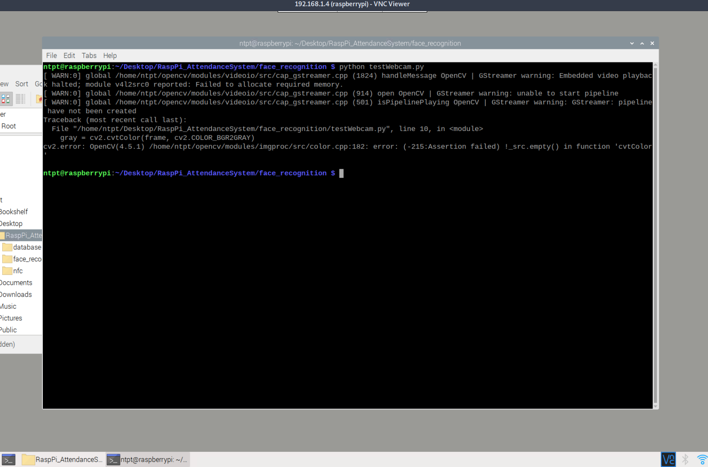

---
author:
- Nguyen Tran Phuoc Thanh - 1912059
title: Face recognition system with RFID
institute: HCMUT
date: 11/06/2022
---

# Goals (and result)

- Read Mifare 1K card (can do)
- Query to get user associated with such card (can do)
- Face detection, extraction, training and recognition (can do)
- Putting it all together (fail, reasons later)

**GitHub link**: [https://github.com/ntpt7921/RaspPi_AttendanceSystem](https://github.com/ntpt7921/RaspPi_AttendanceSystem)

# General overview of project

- Detect and read card ID
- With card ID, query the local database to get info
- Such info includes where to find recognition model
- Using face detection to extract face captured in camera
- Load the recog model and authenticate using extracted face
- A new model can be trained and added

# Read Mifare card

- Mifare card can easily be read by PN532 breakout module with provided library
- Many function already provided (wait for card, authentication, read, write)
- Each Mifare card have 0 block unwritable
    - Meaning content of this block can be use to identify cards
- We only wait and read block 0 of each card

# Database

- Nothing interesting, just a simple associated array (`dict` data type in Python), mapping ID to model name.
- Can save and load content from a JSON file

# About face detection and recognition

- Use OpenCV (4.5.1).
- Differenciate:
    - Detection: Figuring out which part in a picture is a face
    - Recognition: Mapping a face to a ID
- Detection: Use mainly OpenCV's DNN, but also implement Haar and LBP
- Recognition: Only use OpenCV's LBPH

# Face detection

- There are three option:
    - LBH: Fast, less ambience light sensitive
    - Haar: Slower, sensitive to lighting condition, but more accurate
    - DNN: As fast as Haar, better accuracy
- Link to article comparing these in note file on GitHub
- Choose to use DNN

# Face recognition

- There are many possible method, but implement only LBPH
- Work on similar principles with LBH detection

# Reason

- Firstly, the current state:
    - Read card (can do on RaspPi)
    - Database (can do on both RaspPi and laptop)
    - OpenCV using the camera (can only do on laptop)
    - OpenCV face recognition and detection (can only do on laptop)
- Error trying to get OpenCV to open the camera pipeline
    - Try using raspberry's apt repo
    - Try compiling OpenCV locally
    - Also try using pip repo
- Maybe my RaspPi4 don't have enough RAM

# Reason

